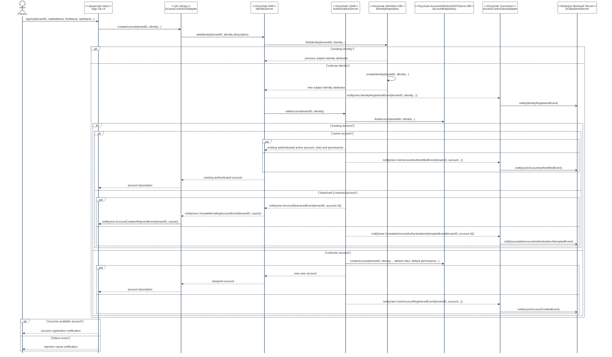

# AC-2(8) DYNAMIC ACCOUNT MANAGEMENT

Feature Type: security control

Requirement: [defined specification](https://www.notion.so/cybnity/AC-2-8-Dynamic-account-management-72d42a96723c48e5b254c59fd24b6bc8?pvs=4)

## Account Registration Flow

#
[Back To Home](README.md)
