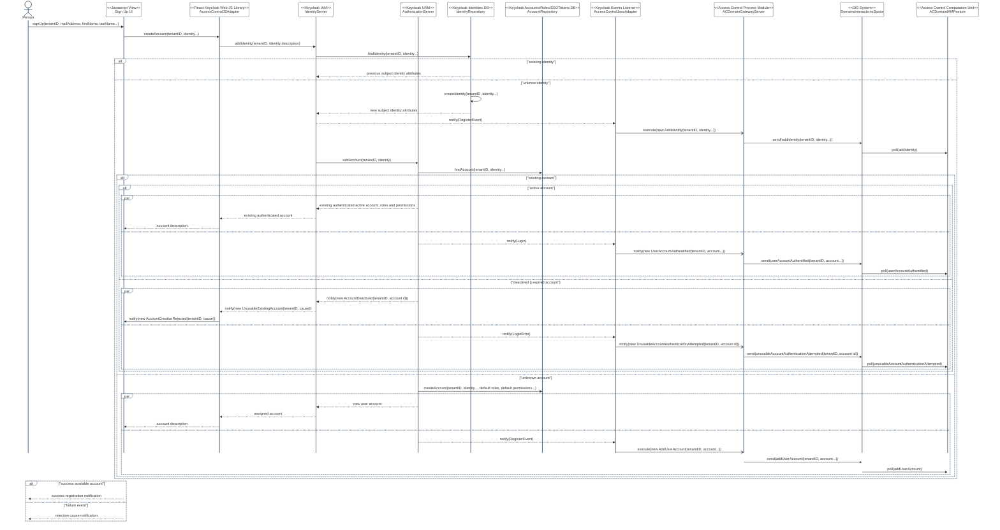

# AC-2(8) DYNAMIC ACCOUNT MANAGEMENT

Feature Type: security control

Requirement: [defined specification](https://www.notion.so/cybnity/AC-2-8-Dynamic-account-management-72d42a96723c48e5b254c59fd24b6bc8?pvs=4) including customer journey diagrams.

## Tenant (Realm) Registration Flow

RealmRepresentation that is dynamically defined and include all the settings regarding the client scopes and security information required for future connections to Keycloak realm by the CYBNITY backend components (e.g client scopes).

```mermaid
%%{
  init: {
    'theme': 'base',
    'themeVariables': {
        'background': '#ffffff',
        'fontFamily': 'arial',
        'fontSize': '18px',
        'primaryColor': '#fff',
        'primaryBorderColor': '#0e2a43',
        'secondaryBorderColor': '#0e2a43',
        'tertiaryBorderColor': '#0e2a43',
        'edgeLabelBackground':'#0e2a43',
        'lineColor': '#0e2a43',
        'tertiaryColor': '#fff'
    },
    'sequence': {
		'mirrorActors': false
    }
  }
}%%
sequenceDiagram
  actor Person
  participant OrganizationRegistrationWebUI as <<Javascript View>><br>Organization Registration UI
  participant AccessControlJSAdapter as <<JS Library>><br>AccessControlJSAdapter
  participant ACBackendServer as <<Reactive Backend Server>><br>ACBackendServer
  participant UsersInteractionsSpace as <<UIS System>><br>UsersInteractionsSpace
  participant ACDomainGatewayServer as <<Access Control Process Module>><br>ACDomainGatewayServer
  participant AccessControlJavaAdapter as <<Keycloak Connector>><br>AccessControlJavaAdapter
  participant RealmResource as <<Keycloak Resource>><br>RealmResource
  participant IdentityServer as <<Keycloak IAM>><br>IdentityServer
  participant SignUpWebUI as <<Javascript View>><br>Sign Up UI
  participant DomainsInteractionsSpace as <<DIS System>><br>DomainsInteractionsSpace
  Person->>OrganizationRegistrationWebUI: signUp(organizationName)
  OrganizationRegistrationWebUI->>AccessControlJSAdapter: createOrganization(organizationName)
  AccessControlJSAdapter->>ACBackendServer: execute(new RegisterOrganization(organizationNaming))
  ACBackendServer->>UsersInteractionsSpace: publish(registerOrganization(organizationNaming))
  UsersInteractionsSpace->>ACDomainGatewayServer: onMessage(registerOrganization(organizationNaming))
  ACDomainGatewayServer->>AccessControlJavaAdapter: findTenant(String organizationNaming, Boolean includingExistingUsers)
  AccessControlJavaAdapter->>IdentityServer: RealmResource existingRealm = realm(String realmName)
  IdentityServer-->>AccessControlJavaAdapter: null or existing realm returned as equals organization named
  alt existingRealm != null
  	AccessControlJavaAdapter->>RealmResource: Integer realmIncludingValidUsersQty = users().count().countEmailVerified()
  	RealmResource-->>AccessControlJavaAdapter: zero or count of verified user accounts regarding the existing realm name
  	AccessControlJavaAdapter-->>ACDomainGatewayServer: Tenant existingTenant = new Tenant(equals organization name, current verified accounts quantity)
  else
    	AccessControlJavaAdapter-->>ACDomainGatewayServer: Tenant existingTenant = null
  end

  alt existingTenant != null && existingTenant.validUsers() > 0
	ACDomainGatewayServer-->>UsersInteractionsSpace: publish(new ExistingTenantAlreadyUsed(organizationNaming used by valid registered accounts))
	UsersInteractionsSpace-->>ACBackendServer: onMessage(existingTenantAlreadyUsed)
	ACBackendServer-->> AccessControlJSAdapter: rejected creation for cause of existing named organization that is already used by previous register
	AccessControlJSAdapter-->>OrganizationRegistrationWebUI: refused creation for cause
	OrganizationRegistrationWebUI-->>Person: rejection cause notification
  else (existingTenant != null && existingTenant.validUsers() == 0) as re-assignable to new requestor
	ACDomainGatewayServer->>ACDomainGatewayServer: boolean authorizedRealAssigning = true
  end

  opt (existingTenant != null && authorizedRealAssigning == true) || existingTenant == null
	opt existingTenant == null
	  ACDomainGatewayServer->>AccessControlJavaAdapter: createTenant(String organizationName)
	  AccessControlJavaAdapter->>AccessControlJavaAdapter: RealmRepresentation organizationRealm = buildRealmRepresentation(configurationSettings)
	  AccessControlJavaAdapter->>IdentityServer: create(organizationRealm)
	  IdentityServer-->>AccessControlJavaAdapter: success realm registration confirmation (and access control settings recorded)
	  AccessControlJavaAdapter->>IdentityServer: RealmResource existingRes = realm(String realmName)
	  IdentityServer-->>AccessControlJavaAdapter: existingRes equals organization named
	  AccessControlJavaAdapter-->>ACDomainGatewayServer: new Tenant(found organization description)
	end
	alt authorizedRealAssigning == false
	  par
	  	ACDomainGatewayServer->>DomainsInteractionsSpace: execute(new AddTenant(existingTenant description, new TenantConnectorConfiguration(new created tenant regarding future Keycloack adapter client connections via dedicated realm's clientscope setting)))
	  and
	  	ACDomainGatewayServer->>ACDomainGatewayServer: OrganizationRegistered organizationActioned = prepare new OrganizationRegistered(new created tenant description) for domain storage notification and confirmation send
	  end
	else authorizedRealAssigning == true
	  ACDomainGatewayServer->>ACDomainGatewayServer: OrganizationRegistered organizationActioned = prepare new OrganizationRegistered(previous existing tenant description) for domain storage notification and confirmation send
	end
		
	par
	  ACDomainGatewayServer-->>UsersInteractionsSpace: publish(organizationActioned)
	  UsersInteractionsSpace-->>ACBackendServer: onMessage(organizationActioned)
	  ACBackendServer-->>AccessControlJSAdapter: organizationActioned about tenantID of created or reassigned organization
	  AccessControlJSAdapter-->>OrganizationRegistrationWebUI: tenantID
	  OrganizationRegistrationWebUI-->>Person: success organization registration notification
	  OrganizationRegistrationWebUI->>SignUpWebUI: show(tenantID)
	and
	  ACDomainGatewayServer->>DomainsInteractionsSpace: [received keycloack admin event]/send(new SaveRegisteredOrganization(Keycloack registered realm as Organization and Tenant)) into Access Control domain layer
	end
  end

```

## User Account Registration Flow

#
[Back To View](README.md)
