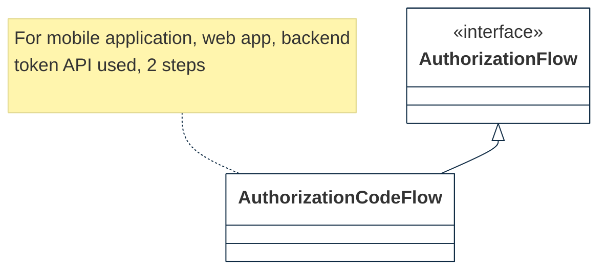
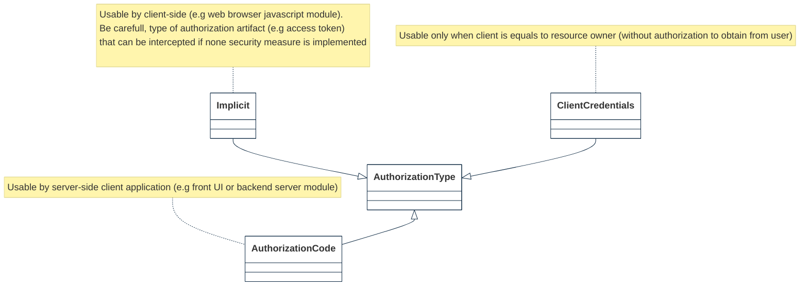

# AC-4 INFORMATION FLOW ENFORCEMENT

Feature Type: security control

Requirement: [defined specification](https://www.notion.so/cybnity/AC-4-Information-Flow-Enforcement-35a6c4aca8c547ed98da42dce281fc9a?pvs=4)

## Authorization flow
Multiple OIDC algorithm implementations are existing that are materialized as AuthorizationFlow types.

The ImplicitFlow (direct come back of access tokens without usage of the token API; none client recorded, no refresh token) is voluntary not retained by CYBNITY.

Generally used for JavaScript application without backend module, this approach is not implemented by CYBNITY software suite.

## Access authorization types
Define the several types of authorizations which are supported by the Access Control Process Module and that can be managed (e.g requested, accepted, rejected) by a stakeholder (e.g CISO of security team).

Based on OAuth2 standard, the ResourceOwnerCredential authorization type is voluntary not supported by the CYBNITY software (cause: not strongly secure).

#
[Back To Home](README.md)
