# AC-3(7) ROLE-BASED ACCESS CONTROL

Feature Type: security control

Requirement: [defined specification](https://www.notion.so/cybnity/AC-3-7-Role-based-access-control-43fa18e487fa43cabf3ae7d9aeb691a6?pvs=4)

## Authorization policy strategy
Several policy strategy types are supported by the Access Control Process Module according to the kind of resource and relation between clients and object where usage privileges are controlled.

Some policy types usage make sens into specific context (e.g Identity and Access Management; Client Identity and Access Management).

```mermaid
%%{
  init: {
    'theme': 'base',
    'themeVariables': {
        'background': '#ffffff',
        'fontFamily': 'arial',
        'fontSize': '18px',
        'primaryColor': '#fff',
        'primaryBorderColor': '#0e2a43',
        'secondaryBorderColor': '#0e2a43',
        'tertiaryBorderColor': '#0e2a43',
        'edgeLabelBackground':'#0e2a43',
        'lineColor': '#0e2a43',
        'tertiaryColor': '#fff'
    }
  }
}%%

classDiagram
  AuthorizationPolicy <|-- RoleBasedAccessControl
  AuthorizationPolicy <|-- TimeBasedAccessControl
  AuthorizationPolicy <|-- RegexBasedAccessControl
  AuthorizationPolicy <|-- ClientScopeBasedAccessControl
  AuthorizationPolicy <|-- UserBasedAccessControl
  AuthorizationPolicy <|-- ClientBasedAccessControl
  AuthorizationPolicy <|-- GroupBasedAccessControl
  GroupBasedAccessControl --> "0..*" GroupBasedAccessControl :children
  note for RoleBasedAccessControl "Ideal for least privilege and need to know approach.<br>For a system (e.g basis network module)<br><br>"
  note for TimeBasedAccessControl "During a defined time period"

  class AuthorizationPolicy {
    <<IAM scope>>
  }
  class RoleBasedAccessControl {
  }
  class TimeBasedAccessControl {
  }
  class ClientBasedAccessControl {
    <<CIAM scope>>
  }
  class UserBasedAccessControl {
  }
  class AttributesBasedAccessControl {
    <<AuthorizationPolicy>>
  }
  class GroupBasedAccessControl {
  }
  class ClientScopeBasedAccessControl {
	-scope : ScopeAttribute
  }
  class RegexBasedAccessControl {
    -identityPattern : IdentityAttribute[]
  }

```

```mermaid
%%{
  init: {
    'theme': 'base',
    'themeVariables': {
        'background': '#ffffff',
        'fontFamily': 'arial',
        'fontSize': '18px',
        'primaryColor': '#fff',
        'primaryBorderColor': '#0e2a43',
        'secondaryBorderColor': '#0e2a43',
        'tertiaryBorderColor': '#0e2a43',
        'edgeLabelBackground':'#0e2a43',
        'lineColor': '#0e2a43',
        'tertiaryColor': '#fff'
    }
  }
}%%

classDiagram
  note for AttributesBasedAccessControl "Policy of policies that can depend of context"
  IResource <|.. ControlledResource
  Unmodifiable <|.. ControlledResource
  AttributesBasedAccessControl o-- "1..*" SubjectAttribute :subjectDescriptions
  AttributesBasedAccessControl o-- "1..*" ActionAttribute :actionDescriptions
  AttributesBasedAccessControl o-- "1..*" EnvironmentAttribute :environmentDescriptions
  note for SubjectAttribute "Attributes describing the subject who is demanding access<br>(e.g roles, group memberships, competencies, user ID, etc..)<br><br>"
  note for ActionAttribute "Combination of attributes describing what user<br>want to perform (e.g read, write, action type)<br><br>"
  note for ControlledResource "Information asset or object impacted by the action"
  note for EnvironmentAttribute "Common attribute related to the current time and location from<br>where access is requested, type of communication channel, or client type<br><br>"

  class ControlledResource {
    <<abstract>>
    #resource : IResource
    -policies : Collection~AuthorizationPolicy~
    ControlledResource(IResource resource, Collection~AuthorizationPolicy~ controls)
    +controledBy() Collection~AuthorizationPolicy~
  }
  class AttributesBasedAccessControl {
    <<AuthorizationPolicy>>
    -subjectDescription : Collection~SubjectAttribute~
    -actionableActions : Collection~ActionAttribute~
    -environmentDescription : Collection~EnvironmentAttribute~
    +AttributesBasedAccessControl(Collection~SubjectAttribute~ subjectDescription, Collection~ActionAttribute~ actionableActions, Collection~EnvironmentAttribute~ environmentDescription)
  }
  class ActionAttribute {
    <<interface>>
  }
  class EnvironmentAttribute {
	<<interface>>
  }
  class SubjectAttribute {
	<<abstract>>
  }
  class ActionAttribute {
	<<interface>>
  }

```

#
[Back To View](README.md)
