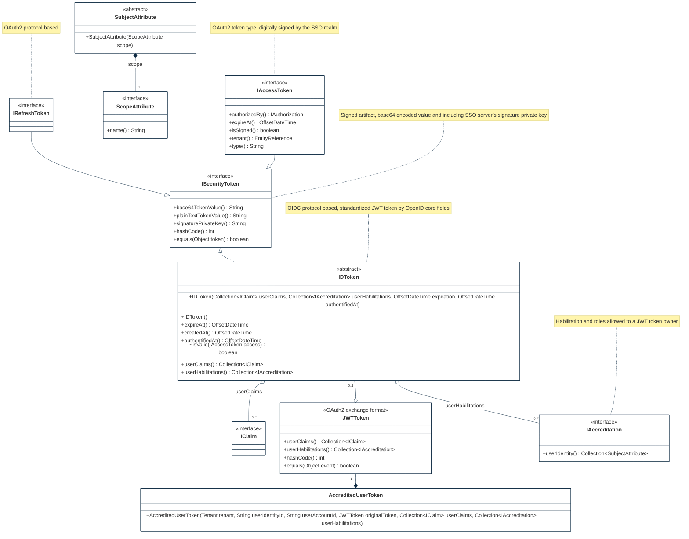
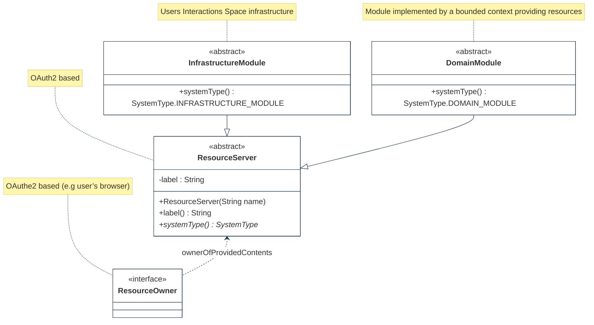
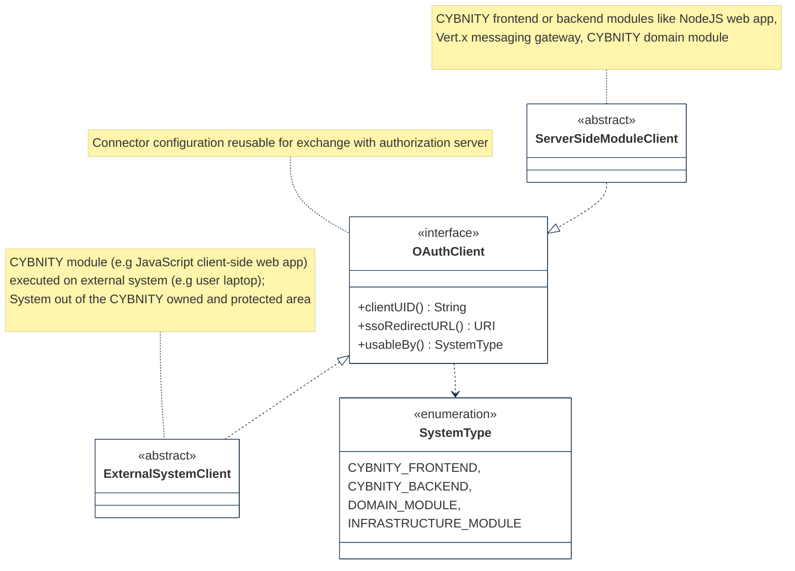
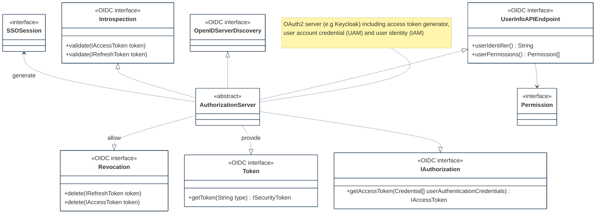

# IA-2(10) SINGLE SIGN-ON

Feature Type: security control

Requirement: [defined specification](https://www.notion.so/cybnity/IA-2-10-Single-sign-on-c892bcc5227d45f99d23a4fade607e7d?pvs=4)

## OIDC Access control
OAuth2 and OIDC protocol are selected as main supported elements by the Access Control API adapter. DTO objects are exposed, manipulated and transformed by the AC adapter API component encapsulating the implementation coupling (e.g with Keycloak OIDC implementation classes in dependency like selected implementation technology as authorization server).

#
[Back To View](README.md)
