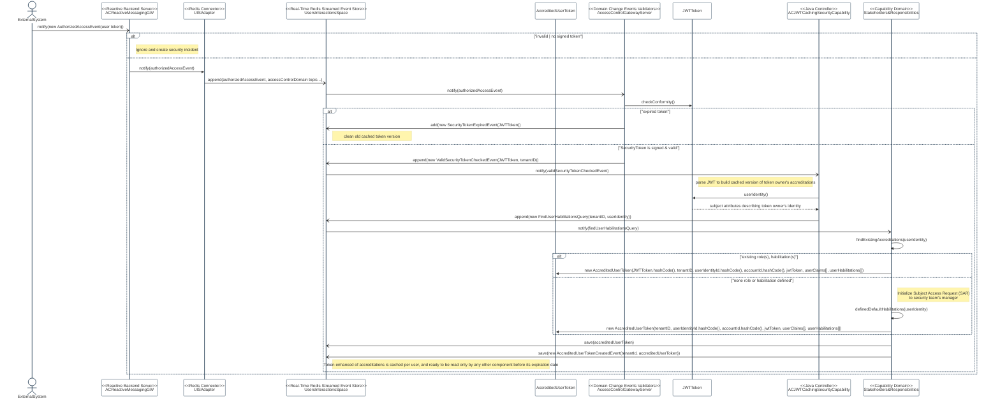

# AC-24(1) TRANSMIT ACCESS AUTHORIZATION INFORMATION

Feature Type: security control

Requirement: [defined specification](https://www.notion.so/cybnity/AC-24-1-Transmit-access-authorization-information-3bf2f16555d849979d90cb324d4ed007?pvs=4)

## Access control enforcement flow
Specification of the synchronization of the authenticated user account role/accreditations on the Users Interactions Space based on the first presented access token to the backend messaging gateway.

It allow autonomous sso check by any capability/application module when the user’s JWT token (which does not include the current/real-time managed user’s roles/accreditations managed by stakeholders domain) is presented to them, and allow to check quickly the authorized RBAC or ABAC to requested resource (e.g materialized by request command including the JWT in event transport enveloppe).

This decoupled JWT access token and role/accreditions reduce the risk of extraction/change/view of current user’s roles/permission when the JWT is out-of server (e.g stored in user’s browser side) and/or by an intermediary server (e.g network proxy providing JWT reference to browser for retrieve it from stored session).

The JWT shared end-to-end between systems only include SSO validated token (is user authenticated before expiration time?), and real-time managed accreditations are only stored temporary into the Users Interactions Space for authorization checks by any server-side module during resources accesses by account’s owner.

#
[Back To Home](README.md)
