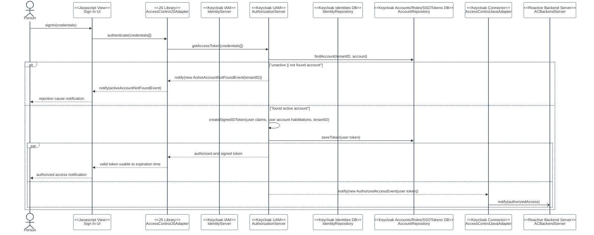

# AC-3 USER ACCESS ENFORCEMENT

Feature Type: security control

Requirement: [defined specification](https://www.notion.so/cybnity/AC-3-User-Access-Enforcement-d836d0fabdaf4fc5b6d22dcbd5e551f8?pvs=4)

## Authentication flow

#
[Back To Home](README.md)
