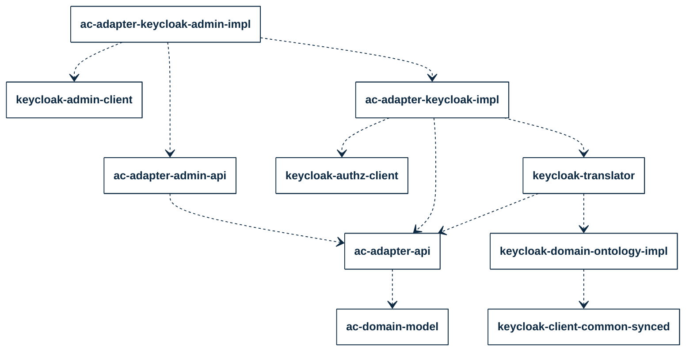

## PURPOSE
Presentation of the infrastructure adaptation module allowing to make interactions with the UIAM solution (Single-Sign On service, and embedded IAM capabilities) provided by Keycloak system.

It's a specific client implementation module of CYBNITY infrastructure connector packaged as Java library which can be embedded by securized CYBNITY other module (e.g component of Access Control domain).

It an implementation project of library providing scope of features relative to administration and supervision of UAM (e.g authentication and authorization settings management) and IAM (e.g realm management regarding multi-tenants).

| Cloudified As | Component Category               | Component Type      | Deployment Area      | Platform Type      |
|:--------------|:---------------------------------|:--------------------|:---------------------|:-------------------|
|               | CYBNITY Technical Service System | Application Service | CYBNITY Domains Area | IT & Data Platform |

# IMPLEMENTATION STACK
The main technologies set is:
- Java Library
- [Keycloak client](https://github.com/keycloak/keycloak-client?tab=readme-ov-file)

## Adaptation Components Dependencies

