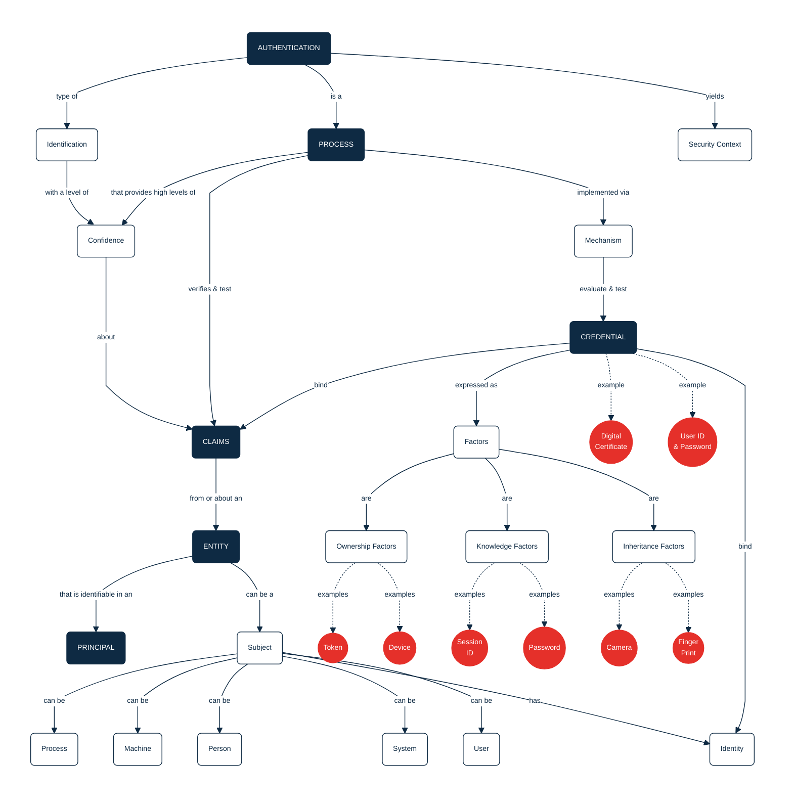

## PURPOSE
Presentation of the domain concerns and logical components supporting the Access Control bounded context at the model layer.

# FUNCTIONAL VIEW

# DESIGN VIEW
Several components of specification or implementation are supporting the domain provided over the `org.cybnity.application.access-control.domain` project's deliverable.

## STRUCTURE MODELS
Several sub-packages are implemented according to the specialization of sub-domains.

### IAM SUB-PACKAGE
The package `org.cybnity.accesscontrol.iam.domain.model` provide standard components regarding the access control of any type, as Identity & Access Management (IAM) features and domain objects.

| Class Type              | Motivation                                                                                                                  |
|:------------------------|:----------------------------------------------------------------------------------------------------------------------------|
| Account                 | Domain root aggregate object relative to a subject's usable account                                                         |
| OrganizationalStructure | Organizational structure (e.g company, association, group of companies, institution) who can have interactions with systems |
| Person                  | Physical social entity (e.g human person)                                                                                   |
| SmartSystem             | Represent a software and/or hardware system (e.g autonomous accessory representing a person or organization)                |

### AUTHORIZATION SUB-PACKAGE
The package `org.cybnity.accesscontrol.authorization.domain.model` provide components required to the authorization behaviors.

### CIAM SUB-PACKAGE
The package `org.cybnity.accesscontrol.ciam.domain.model` provide components required to manage Client Identity and Access Management (CIAM) of customer people requiring the support of authentication specific/enhanced use cases.

### PAM SUB-PACKAGE
The package `org.cybnity.accesscontrol.pam.domain.model` of elements required to implement the Privileged Access Management (PAM) regarding specific people, systems, processes that need to use specific access (e.g for administration action) based on robust means (e.g just-in-time access to a critical resource, remote access using encrypted gateway in place of password).

# IMPLEMENTATION VIEW
Presentation of the core components and files organization, packaging models and dependencies, and addressed configuration management of systems released. Globally this section give overview of technical components and structures implemented as domain layer.

- Structural diagrams regarding the domain model components matching the Keycloak domain elements
  - [CYBNITY Domain Model Mapping with Keycloak domain components](cybnity-keycloak-components-mapping.md)
- Behavioral diagrams regarding the interactions, states machines and activities provided by the model
- System assembly is mainly managed by Maven as a Java library artifact reused by the application service layer

# RELEASES HISTORY
- [V0 - FRAMEWORK changes list](v0-changes.md)

#
[Back To Home](/README.md)
