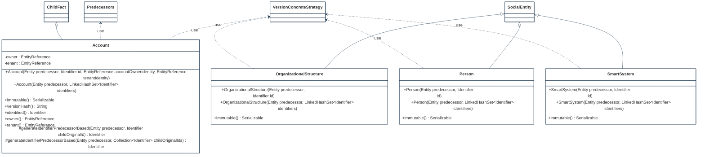

## PURPOSE
Presentation of the domain components.

# FUNCTIONAL VIEW

# DESIGN VIEW
Several components of specification or implementation are supporting the domain provided over the `org.cybnity.application.access-control.domain` project's main package.

|Class Type|Motivation|
| :-- | :-- |
|Account|Domain root aggregate object relative to a subject's usable account|
|OrganizationalStructure|Organizational structure (e.g company, association, group of companies, institution) who can have interactions with systems|
|Person|Physical social entity (e.g human person)|
|SmartSystem|Represent a software and/or hardware system (e.g autonomous accessory representing a person or organization)|

## STRUCTURE MODELS

### MODEL SUB-PACKAGE

# RELEASES HISTORY
- [V0 - FRAMEWORK changes list](v0-changes.md)

#
[Back To Home](/README.md)
