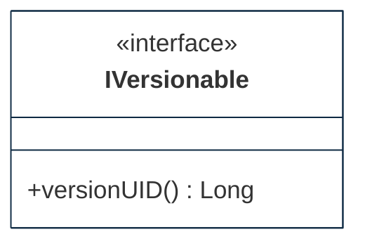

## PURPOSE
Presentation of the domain components.

# FUNCTIONAL VIEW

# DESIGN VIEW
Several components of specification or implementation are supporting the domain.

|Class Type|Motivation|
| :-- | :-- |
|Command|Imperative and identifiabl element that is a request for the system to perform a task|

## STRUCTURE MODELS

### Sub-Packages
See the presentation of detailed structure models implemented into the sub-packages.

# RELEASES HISTORY
- [V0 - FRAMEWORK changes list](v0-changes.md)
