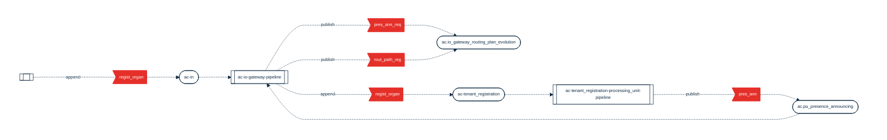

## PURPOSE
The space presents the implementation view of the developed Access Control systems acting into the application layer.
The presented implementation view of this section are mainly focused on transversal information involving several implementation components (see sub-packages dedicated documentations for more detail per component and/or module).

# COMPONENTS INTEGRATION
Presentation of the coupling models implemented as static or dynamic links between applicative modules (e.g process module, feature module) over interactions spaces (e.g Users Interactions Space; or Domains Interactions Space).
Several modules are involved to execute the functions over the integration architecture, that define multiple approach in terms of modularity relative to the features which are under their responsibilities.

Basically, each system (e.g capability or domain application system) can:
- host itself multiple feature modules assembled as an integrated system; the internal modules (e.g each Verticle feature module) can collaborate over dedicated topics/streams that are reserved to them without accessibility promoted out of the system
- be a combination of compatible and independent features modules executed in standalone context (e.g micro-service per feature scope) which can collaborate over dynamic configured routing plan

The decision of system combination as integrated or distributed is taken according to the complexity and quantity of features integrated, and/or to the need of specific configuration required per module (e.g specific performance level, volume of feature source code and processes maintained).

## AC-DOMAIN-GATEWAY-SERVER SYSTEM
This system is packaged as an integrated and standalone module which collaborate with the domain features modules. It acts as a Domain Gateway Server of the Access Control application layer.
It is responsible of the input events (e.g received from the ac-backend-server module) coming from the Users Interfaces Area and it manage control, distribution to feature modules.

Named `AccessControlDomainIOGateway` (ac-io-gateway logical name) this module is in charge to manage the routing plan of events to feature modules, through an input/output pipeline which ensure the collaboration with the features module.

The developed pipeline is `DomainIOEventsPipeline` (identified by logical name ac-io-gateway-pipeline).

## AC-RTS-COMPUTATION-UNIT
This system is a Processing Unit (PU) that is a combination of features pipelines (as functional process modules) assembled in terms of deployable executable component.

Named `AccessControlDomainProcessModule`, this module is in charge to start and support the configuration of the runtime relative to each feature pipeline of the Access Control application layer.

The developed pipelines are:
- `TenantRegistrationFeaturePipeline` (identified by logical name ac-tenant_registration-processing_unit-pipeline).

## STREAMS & CHANNELS OVERVIEW
Several Redis streams (persistent) or topics (not persistent) are contributor of a routing plan between the domain features in a dynamic way.

The Dynamic Router pattern supported by Recipient List utility (list of dynamically specified recipients) is implemented that allow real-time instantiation and change of the events transport which are exchanged by the components into the application layer.

All the channels naming conventions are defined by static Java enum provided by API components and separator used in short name are defined by the `NamingConvention` enum.

| Usage Category      | Channel Name                                             | Short Name                           | Channel Type | Supported Event Types                                                                                                                                                                                           | Ownership                                       |
|:--------------------|:---------------------------------------------------------|:-------------------------------------|:-------------|:----------------------------------------------------------------------------------------------------------------------------------------------------------------------------------------------------------------|:------------------------------------------------|
| UICapabilityChannel | access_control_in                                        | ac-in                                | Redis Stream | Command(CommandName.REGISTER_ORGANIZATION)                                                                                                                                                                      | ac-io-gateway-pipeline                          |
| UICapabilityChannel | access_control_pu_presence_announcing                    | ac.pu_presence_announcing            | Redis Topic  | DomainEvent(ProcessingUnitPresenceAnnounced)                                                                                                                                                                    | ac-io-gateway-pipeline                          |
| UICapabilityChannel | access_control_io_gateway_dynamic_routing_plan_evolution | ac.io_gateway_routing_plan_evolution | Redis Topic  | Command(CollaborationEventType.PROCESSING_UNIT_PRESENCE_ANNOUNCE_REQUESTED), DomainEvent(CollaborationEventType.PROCESSING_UNIT_ROUTING_PATHS_REGISTERED)                                                       | ac-io-gateway-pipeline                          |
| UICapabilityChannel | access_control_tenant_registration                       | ac-tenant_registration               | Redis Stream | Command(CommandName.REGISTER_ORGANIZATION)                                                                                                                                                                      | ac-tenant_registration-processing_unit-pipeline |
| UICapabilityChannel | access_control_tenants_changes                           | ac.tenants_changes                   | Redis Topic  | DomainEvent(org.cybnity.application.accesscontrol.ui.api.event.DomainEventType.TENANT_REGISTERED), DomainEvent(org.cybnity.application.accesscontrol.ui.api.event.DomainEventType.TENANT_REGISTRATION_REJECTED) | ac-tenant_registration-processing_unit-pipeline |

## DYNAMIC ROUTING MAP
The routing map here presented is dynamically build and updated by the components during the runtime.

#### Legend
| Element Label  | Element Type                                                       |
|:---------------|:-------------------------------------------------------------------|
| pres_ann_req   | CollaborationEventType.PROCESSING_UNIT_PRESENCE_ANNOUNCE_REQUESTED |
| rout_path_reg  | CollaborationEventType.PROCESSING_UNIT_ROUTING_PATHS_REGISTERED    |
| pres_ann       | ProcessingUnitPresenceAnnounced                                    |
| regist_organ   | CommandName.REGISTER_ORGANIZATION                                  |

#
[Back To Home](/README.md)
